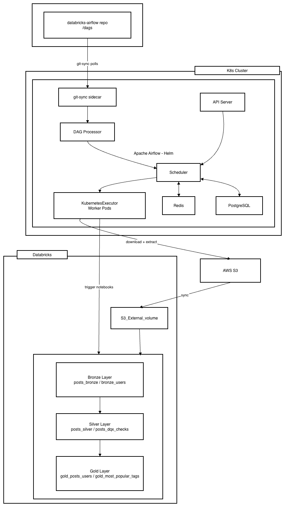

# Databricks Airflow

A data engineering project that orchestrates a medallion data pipeline using Apache Airflow on Kubernetes, with Databricks for data transformation and AWS S3 for storage.

## Architecture



## Overview

- **Airflow** runs on a local [kind](https://kind.sigs.k8s.io/) Kubernetes cluster, deployed via Helm
- **DAGs** are synced automatically from GitHub using the `git-sync` sidecar — no manual DAG deployment needed after a `git push`
- **KubernetesExecutor** spins up isolated worker pods per task
- **Data source**: StackExchange data dump downloaded from [archive.org](https://archive.org/details/stackexchange)
- **Storage**: Raw XML files uploaded to AWS S3
- **Transformations**: Databricks notebooks implement a medallion architecture (Bronze → Silver → Gold)

## Data Pipeline

| Layer         | Notebooks                                    | Description                                                                           |
| ------------- | -------------------------------------------- | ------------------------------------------------------------------------------------- |
| **Ingestion** | `produce_data_assets` DAG                    | Downloads `.7z` from archive.org, extracts `Posts.xml` and `Users.xml`, uploads to S3 |
| **Bronze**    | `posts_bronze`, `bronze_users`               | Raw data ingested into Delta tables                                                   |
| **Silver**    | `posts_silver`, `posts_dqx_checks`           | Cleaned and validated data; DQX quality checks applied                                |
| **Gold**      | `gold_posts_users`, `gold_most_popular_tags` | Aggregated, business-ready datasets                                                   |

## Project Structure

```
.
├── cicd/
│   └── Dockerfile                  # Custom Airflow image with dependencies
├── charts/
│   ├── values-override.yaml        # Helm overrides (git-sync, executor, image)
│   └── values-override-persistence.yaml
├── dags/
│   ├── produce_data_assets.py      # Main ingestion DAG
│   └── test_dag.py                 # Smoke test DAG
├── notebooks/                      # Databricks notebooks (medallion layers)
├── k8s/
│   ├── clusters/                   # kind cluster config
│   ├── secrets/                    # Secret templates (applied from .env)
│   └── volumes/                    # PersistentVolume for logs
├── install_airflow.sh              # Fresh cluster install
├── install_airflow_with_persistence.sh  # Install with log persistence
├── upgrade_airflow.sh              # Upgrade existing deployment
└── requirements.txt                # Python dependencies for the Airflow image
```

## Prerequisites

- [Docker](https://docs.docker.com/get-docker/)
- [kind](https://kind.sigs.k8s.io/docs/user/quick-start/#installation)
- [kubectl](https://kubernetes.io/docs/tasks/tools/)
- [Helm](https://helm.sh/docs/intro/install/)
- AWS credentials configured for S3 access (Airflow `aws_conn` connection)
- A GitHub personal access token with read access to this repo

## Setup

### 1. Configure credentials

Create a `.env` file in the project root (never commit this):

```bash
GIT_USERNAME=<your-github-username>
GIT_PASSWORD=<your-github-token>
```

### 2. Add Airflow Helm repo

```bash
helm repo add apache-airflow https://airflow.apache.org
helm repo update
```

### 3. Install (fresh cluster)

```bash
bash install_airflow_with_persistence.sh
```

This will:

- Create a kind cluster
- Build and load the custom Docker image
- Apply Kubernetes secrets from `.env`
- Install Airflow via Helm with git-sync enabled
- Port-forward the UI to `http://localhost:8080`

### 4. Upgrade (existing cluster)

```bash
bash upgrade_airflow.sh
```

## Accessing the UI

After install/upgrade, the API server is port-forwarded automatically:

```
http://localhost:8080
```

Default credentials: `admin` / `admin`

## Debugging

```bash
# Check all pod statuses
kubectl get pods -n airflow

# Check git-sync logs (DAG sync issues)
kubectl logs -n airflow <dag-processor-pod> -c git-sync-init

# Check DAG import errors
kubectl exec -it -n airflow <scheduler-pod> -c scheduler -- airflow dags list-import-errors

# Check task logs for a stuck task
kubectl logs -n airflow <worker-pod>
```
